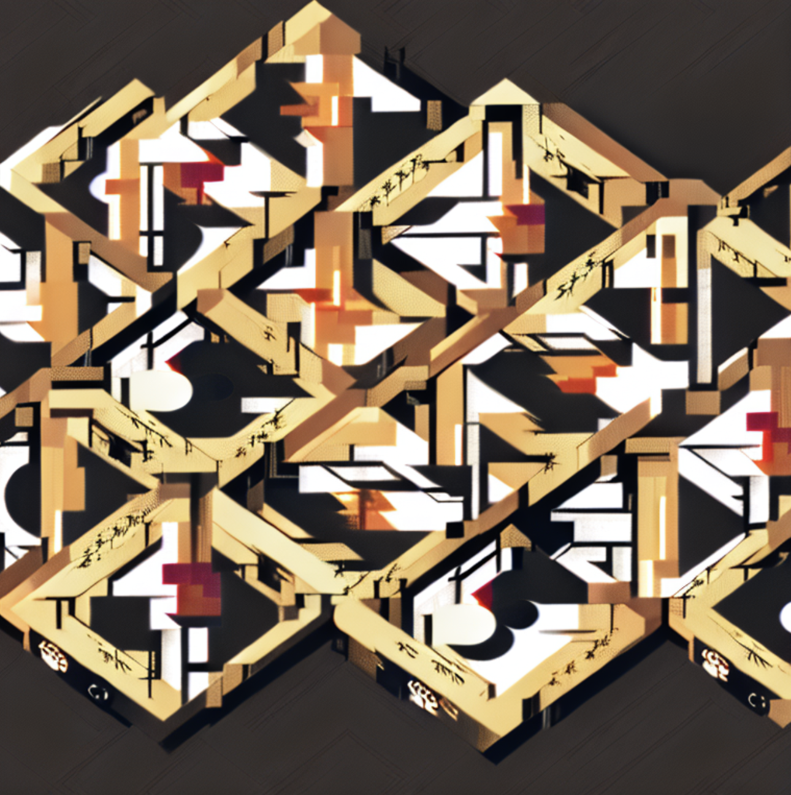

# MusIm

## Introduction

## Usage

```python
from transformers import AutoProcessor
from musim.hf import MusImPipeline

ast_proc = AutoProcessor.from_pretrained("MIT/ast-finetuned-audioset-10-10-0.4593", low_cpu_mem_usage=True)

m2i = MusImPipeline.from_pretrained("juliagsy/musim")
```

## Music-conditioned Image Generation

### Example 1

```python
from PIL import Image
from IPython.core.display import display
from muvis.dataset import ImMuTe

immute_t = ImMuTe("images", "caption.json", "audios", start=0, end=10, sampling_rate=16000, pixel=256, normalize=True)

input_wav, input_img, input_txt = immute_t[2]

wav = ast_proc(input_wav.tolist(), sampling_rate=16000, return_tensors="pt")
wav = wav.to("cuda")

gen_image = m2i(wav)
gen_image_d = Image.fromarray(gen_image)
display(gen_image_d)
```

Generated image:


### Example 2

```python
from PIL import Image
from IPython.core.display import display
from muvis.dataset import ImMuTe

immute_t = ImMuTe("images", "caption.json", "audios", start=0, end=10, sampling_rate=16000, pixel=256, normalize=True)

input_wav, input_img, input_txt = immute_t[5]

wav = ast_proc(input_wav.tolist(), sampling_rate=16000, return_tensors="pt")
wav = wav.to("cuda")

gen_image = m2i(wav)
gen_image_d = Image.fromarray(gen_image)
display(gen_image_d)
```

Generated image:

