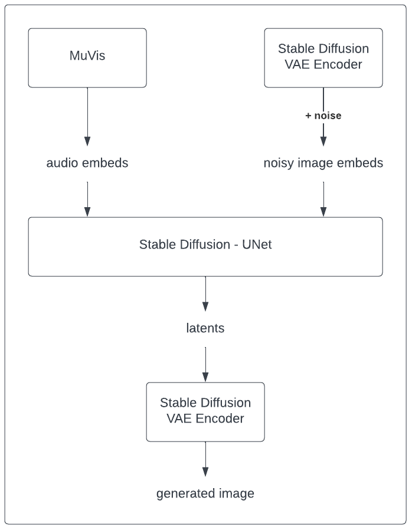
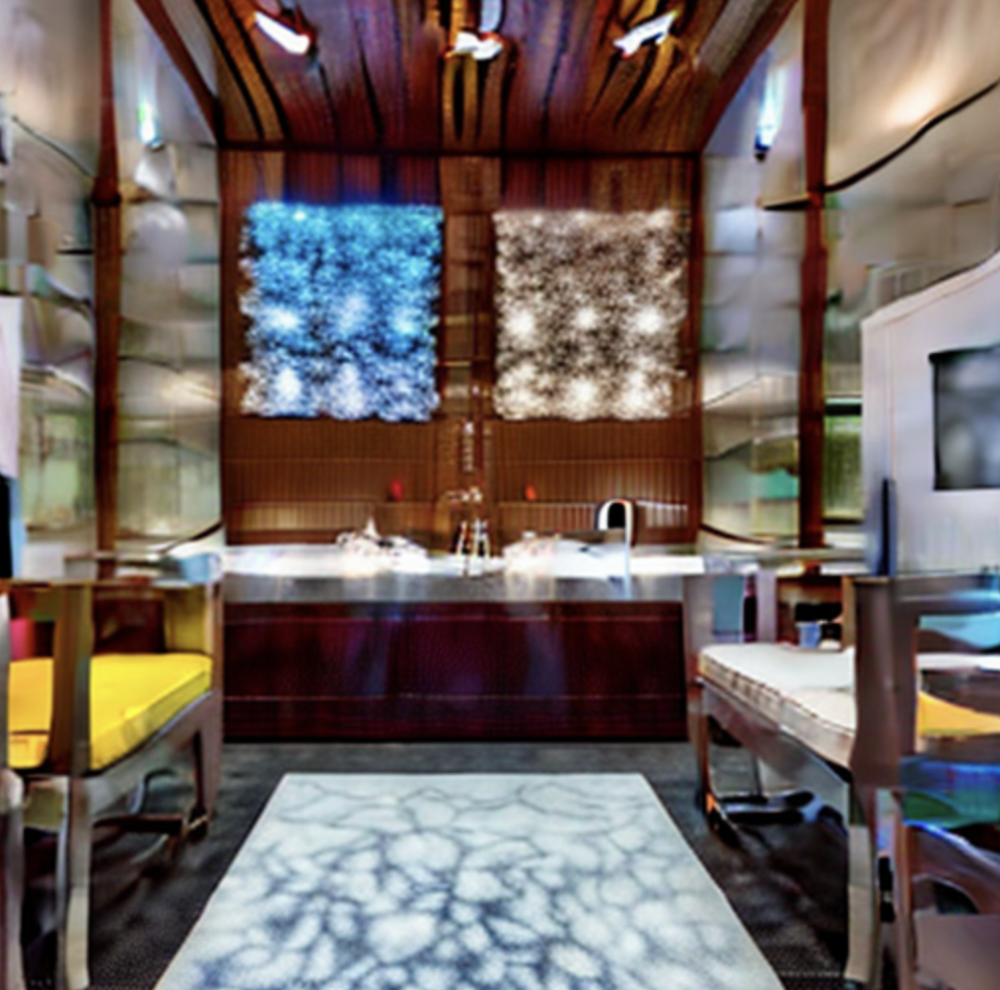
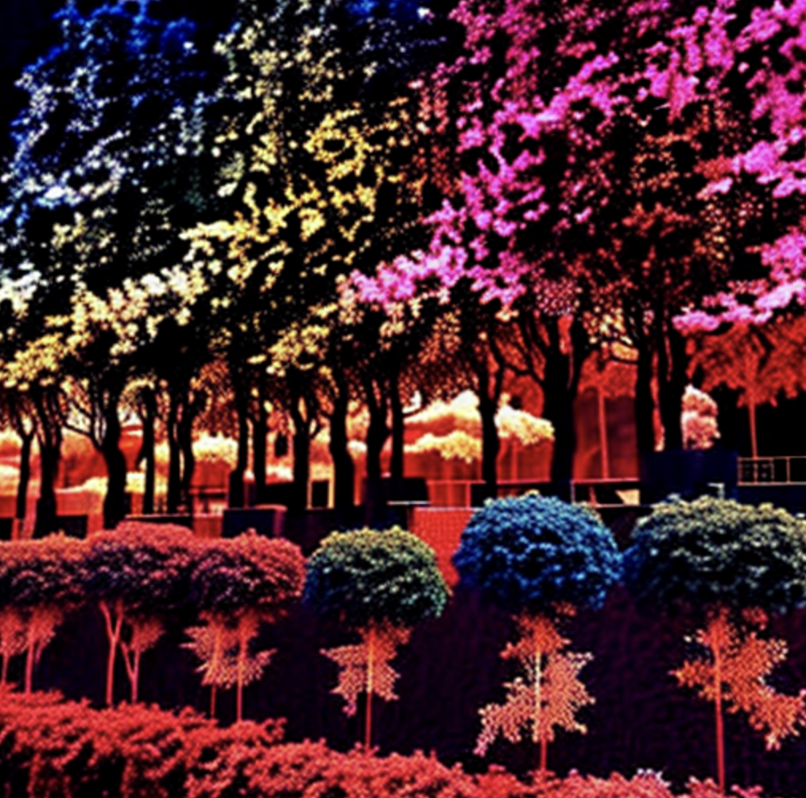
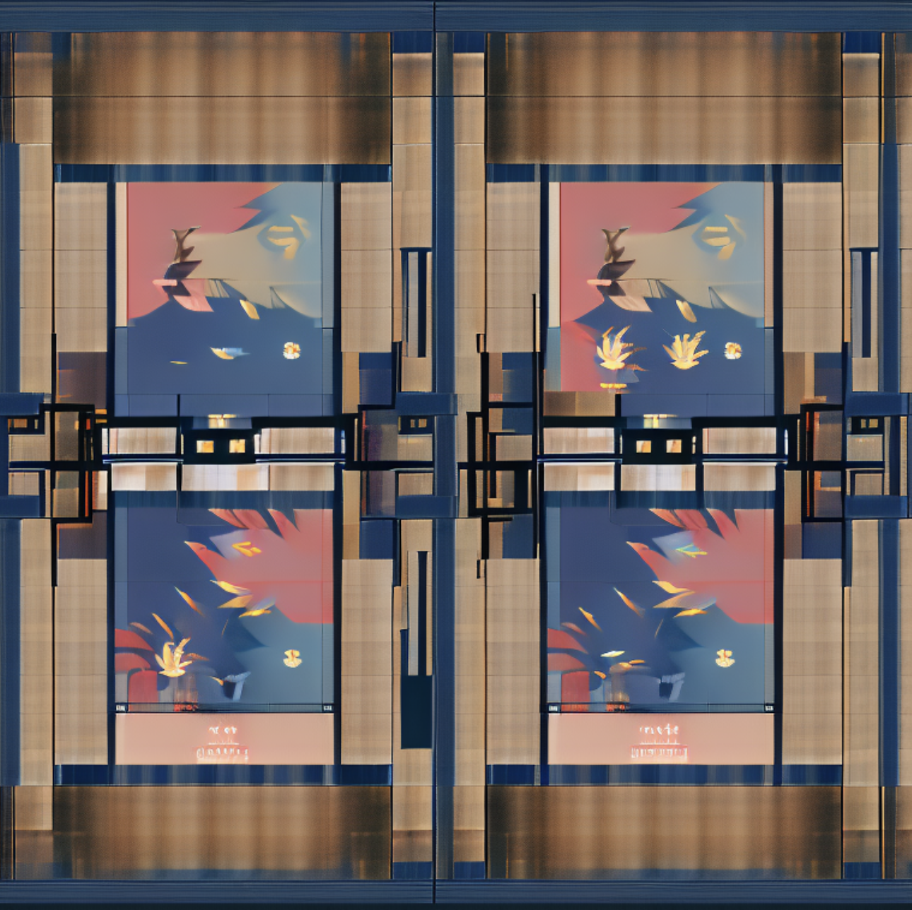

# MusIm

## Introduction

MusIm is introduced as the first open-source music-conditioned image Generative AI. A diffusion-based solution is approached in the architecture design of MusIm, with support from the proven image generation model - Latent Diffusion. The architecture is shown below:



## Usage

```python
from transformers import AutoProcessor
from diffusers import DiffusionPipeline

ast_proc = AutoProcessor.from_pretrained("MIT/ast-finetuned-audioset-10-10-0.4593", low_cpu_mem_usage=True)

m2i = DiffusionPipeline.from_pretrained("juliagsy/musim", custom_pipeline="juliagsy/musim", trust_remote_code=True)
```

## Music-conditioned Image Generation

### Generation

```python
from PIL import Image
from IPython.core.display import display

input_wav = "<your-music>"

wav = ast_proc(input_wav.tolist(), sampling_rate=16000, return_tensors="pt")
wav = wav.to("cuda")

gen_image = m2i(wav)
gen_image_d = Image.fromarray(gen_image)
display(gen_image_d)
```


### Generated Examples 

As music cannot be presented here, some results of the generation are shown by themselves below.

Example generation 1:




Example generation 2:



Example generation 3:




## Citations
